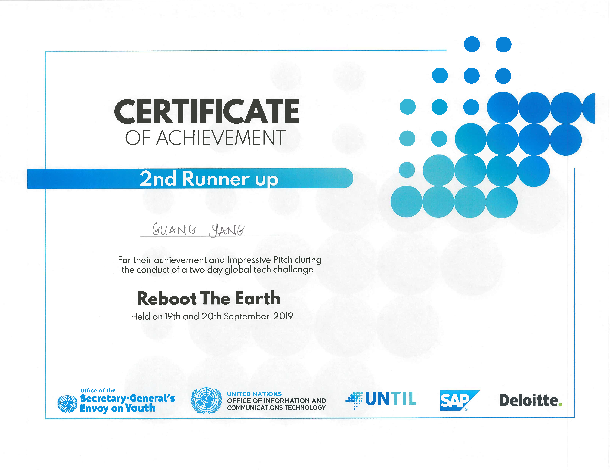

# Recycle It - Reboot the Earth Hackathon!

This repo demostrates how we use object dectect and image classfication to help users easily recognize resin code of different plastic materials. It also shows a user achievement system that aims to promote good recycle activities and reboot our earth.

Team's proposal received 2nd runner up in the competition.

